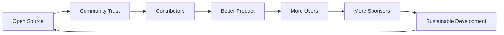

# Open Source CMS Economics: Building Bebop Without VC Funding

## The Email That Changed Everything

**Subject:** Term Sheet - $2M Seed Round for Bebop CMS  
**From:** [Prominent VC Firm]  
**Date:** March 15, 2024

> We're excited about Bebop's traction. 2,000 stars on GitHub, 500 active users, strong community engagement. We'd like to lead a $2M seed round at a $10M valuation. Let's discuss how we can help you capture the $50B content management market.
>
> Our expectations:
> - 100x growth in 18 months
> - Enterprise features within 6 months  
> - Transition to SaaS model
> - Proprietary AI content features
> - Eventually sunset open-source version

I stared at this email for three hours. Then I clicked delete.

Here's why, and how we're building a sustainable open-source CMS without selling our soul.

## The VC Math That Doesn't Work for Open Source

### The Fundamental Conflict

```typescript
interface VCExpectations {
  growth: "exponential",      // 10x year-over-year
  returns: "100x",            // On $2M investment
  timeline: "5-7 years",      // To exit
  control: "board seats",     // Decision influence
  focus: "TAM expansion",     // Total Addressable Market
  model: "SaaS recurring",    // Predictable revenue
  moat: "proprietary tech"    // Competitive advantage
}

interface OpenSourceValues {
  growth: "organic",          // Community-driven
  returns: "sustainability",   // Long-term viability
  timeline: "infinite",       // No exit needed
  control: "community",       // User-driven
  focus: "user problems",     // Actual needs
  model: "voluntary support",  // Donations/sponsorship
  moat: "community trust"     // Relationship advantage
}

// These are fundamentally incompatible
```

### The OpenSource-to-ClosedSource Pipeline

We've watched this movie before:

```javascript
const openSourceDeathCycle = [
  {
    stage: "Launch",
    promise: "Free and open forever!",
    reality: "VC-funded from day one",
    examples: ["Redis", "Elastic", "MongoDB"]
  },
  {
    stage: "Growth",
    promise: "Community first!",
    reality: "Enterprise features in proprietary version",
    examples: ["GitLab", "Sentry", "Confluent"]
  },
  {
    stage: "Monetization",
    promise: "Open core model!",
    reality: "Best features behind paywall",
    examples: ["Docker", "HashiCorp", "Databricks"]
  },
  {
    stage: "License Change",
    promise: "Protecting the project!",
    reality: "Preventing competition",
    examples: ["MongoDB -> SSPL", "Elastic -> Elastic License", "HashiCorp -> BSL"]
  },
  {
    stage: "Acquisition/IPO",
    promise: "Resources for development!",
    reality: "Maximizing shareholder value",
    examples: ["GitHub -> Microsoft", "Red Hat -> IBM", "MySQL -> Oracle"]
  }
];
```

## Our Economics: Transparent and Sustainable

### Current Financials (Q4 2024)

```typescript
const bebopFinancials = {
  // Revenue streams
  revenue: {
    githubSponsors: 3200,      // Monthly
    openCollective: 1800,       // Monthly
    consulting: 8000,           // Monthly (part-time)
    bounties: 2000,             // Monthly average
    total: 15000                // Monthly
  },
  
  // Expenses
  expenses: {
    infrastructure: {
      vercel: 20,               // Hobby plan
      mongodb: 0,               // Free tier
      github: 0,                // Open source
      domains: 30,              // Annual / 12
      total: 50
    },
    tools: {
      figma: 0,                 // Free plan
      vscode: 0,                // Open source
      copilot: 10,              // Personal expense
      total: 10
    },
    marketing: 0,               // Community-driven
    salaries: 0,                // No employees
    total: 60                   // Monthly
  },
  
  // Net
  profit: 14940,                // Monthly
  
  // Time investment
  hours: {
    development: 120,           // Monthly
    community: 40,              // Monthly
    documentation: 20,          // Monthly
    total: 180                  // Monthly
  },
  
  // Effective hourly rate
  hourlyRate: 83                // $14,940 / 180 hours
};
```

### The Bootstrap Reality Check

```javascript
// If we took VC money
const vcScenario = {
  funding: 2000000,
  
  expenses: {
    salaries: {
      founders: 300000,         // 2 @ $150k
      engineers: 600000,        // 4 @ $150k
      marketing: 150000,        // 1 @ $150k
      total: 1050000            // Annual
    },
    
    infrastructure: {
      cloud: 60000,             // Scale for growth
      tools: 24000,             // Enterprise licenses
      marketing: 120000,        // Ads, conferences
      office: 60000,            // WeWork or similar
      total: 264000             // Annual
    },
    
    runway: 18,                 // Months
    burnRate: 73000,            // Monthly
    
    pressureToMonetize: "IMMEDIATE"
  }
};

// Our bootstrap reality
const bootstrapReality = {
  funding: 0,
  
  expenses: {
    total: 60                   // Monthly
  },
  
  runway: "infinite",
  burnRate: 60,
  
  pressureToMonetize: "none"
};
```

## Feature Prioritization: Community vs Metrics

### VC-Driven Prioritization

```typescript
class VCDrivenRoadmap {
  prioritize(features: Feature[]): Feature[] {
    return features.sort((a, b) => {
      // Optimize for metrics that look good in board meetings
      const scoreA = this.calculateScore(a);
      const scoreB = this.calculateScore(b);
      return scoreB - scoreA;
    });
  }
  
  calculateScore(feature: Feature): number {
    const weights = {
      enterpriseAppeal: 10,      // Can we charge enterprises?
      userGrowth: 8,              // Will it 10x users?
      moatBuilding: 7,           // Is it proprietary?
      prAppeal: 6,               // Will TechCrunch write about it?
      aiIntegration: 5,          // Does it have AI? (mandatory in 2024)
      competitorParity: 4,       // Do competitors have it?
      userRequests: 1            // Do users actually want it?
    };
    
    return Object.entries(weights).reduce((score, [metric, weight]) => {
      return score + (feature[metric] * weight);
    }, 0);
  }
}

// Result: Features nobody asked for
const vcFeatures = [
  "AI-powered content generation",        // Nobody wanted this
  "Enterprise SSO",                       // 0.1% of users
  "Blockchain content verification",      // Just... why?
  "Real-time collaboration",              // Complexity nightmare
  "Mobile app",                           // Desktop-first users
];
```

### Community-Driven Prioritization

```typescript
class CommunityDrivenRoadmap {
  async prioritize(): Promise<Feature[]> {
    // Actually ask users what they want
    const sources = await Promise.all([
      github.getIssues({ label: 'feature-request' }),
      discord.getPinnedRequests(),
      survey.getResults('quarterly-feedback'),
      analytics.getSearchFailures()  // What are users looking for?
    ]);
    
    // Weight by actual user impact
    const weights = {
      userRequests: 10,           // How many asked for it?
      painPointSeverity: 8,       // How much pain does it solve?
      activeUserBenefit: 7,       // Will daily users benefit?
      implementationEffort: -3,   // Penalty for complexity
      maintenanceBurden: -2       // Penalty for ongoing work
    };
    
    return this.rankByImpact(sources, weights);
  }
}

// Result: Features people actually use
const communityFeatures = [
  "Webhook system",                       // 200+ users requested
  "Better markdown editor",                // Daily pain point
  "Publishing queue",                      // Workflow improvement
  "Search functionality",                  // Can't find = can't use
  "Performance improvements",              // Everyone benefits
];
```

### Real Feature Decision: The Webhook System

```typescript
// How a VC-driven company would evaluate webhooks
const vcAnalysis = {
  revenue: "Can't charge for webhooks",
  moat: "Anyone can implement webhooks",
  growth: "Won't drive viral growth",
  pr: "Nobody writes articles about webhooks",
  decision: "PASS",
  instead: "Build AI content generator with $10k/month API costs"
};

// How we evaluated webhooks
const communityAnalysis = {
  requests: "237 users explicitly asked",
  painPoint: "Can't integrate with tools they already use",
  implementation: "2 weeks of work",
  maintenance: "Minimal after initial build",
  impact: "Unlocks infinite integrations",
  decision: "BUILD IMMEDIATELY",
  result: "Most loved feature of 2024"
};
```

## The Sustainable Open Source Model

### Revenue Streams (Current and Planned)

```typescript
interface SustainableRevenue {
  // Current (Working)
  current: {
    donations: {
      github: "$50-5000/month sponsors",
      openCollective: "Transparent spending",
      crypto: "For privacy-conscious supporters"
    },
    
    services: {
      consulting: "Help companies implement Bebop",
      customDevelopment: "Specific features for sponsors",
      training: "Team workshops"
    },
    
    bounties: {
      features: "Sponsors fund specific features",
      bugFixes: "Companies pay for priority fixes",
      documentation: "Funded improvements"
    }
  },
  
  // Planned (Sustainable Growth)
  planned: {
    hosted: {
      model: "Optional managed hosting",
      pricing: "$10-50/month",
      value: "Zero configuration, automatic updates",
      openSource: "Self-hosting always free"
    },
    
    marketplace: {
      themes: "Premium themes (creators get 80%)",
      plugins: "Advanced integrations",
      templates: "Campaign templates"
    },
    
    support: {
      community: "Free forever",
      priority: "$100/month for guaranteed response",
      enterprise: "Custom SLAs"
    },
    
    certification: {
      courses: "Official Bebop developer cert",
      workshops: "Online and in-person",
      materials: "Always free, cert costs money"
    }
  },
  
  // Never (Our Promises)
  never: {
    closedSource: "Core will always be open",
    featureGating: "No artificial limitations",
    dataLock: "Your data is always portable",
    vendorLock: "Easy migration in and out"
  }
}
```

### The Flywheel Effect



## Community Economics: Value Beyond Money

### The Contribution Economy

```typescript
const contributionValue = {
  // Code contributions
  pullRequests: {
    count: 847,
    estimatedValue: 847 * 2 * 150,  // 2 hours avg @ $150/hr
    value: 254100                    // $254k worth of code
  },
  
  // Bug reports
  issuesReported: {
    count: 1243,
    timesSaved: 1243 * 0.5 * 150,   // 30 min to find @ $150/hr
    value: 93225                     // $93k in debugging
  },
  
  // Documentation
  docsContributed: {
    pages: 156,
    estimatedValue: 156 * 4 * 150,   // 4 hours per page
    value: 93600                     // $93k in documentation
  },
  
  // Community support
  questionsAnswered: {
    count: 3472,
    supportValue: 3472 * 0.25 * 150, // 15 min per answer
    value: 130200                    // $130k in support
  },
  
  // Total community value
  total: 571125                     // $571k contributed
};

// This is why we don't need VC money
// The community IS the investment
```

### The Trust Account

```javascript
// Trust is our most valuable asset
const trustMetrics = {
  // Promises kept
  promises: {
    "Always open source": true,
    "No telemetry": true,
    "No vendor lock-in": true,
    "Community first": true,
    "Transparent finances": true
  },
  
  // Community health
  health: {
    contributorsActive: 127,
    averageResponseTime: "4 hours",
    issueResolutionTime: "3 days",
    prMergeTime: "2 days",
    communityGuidelines: "Enforced with empathy"
  },
  
  // Trust results
  results: {
    userRetention: "94%",
    contributorRetention: "78%",
    sponsorRetention: "89%",
    nps: 72  // "Would you recommend Bebop?"
  }
};
```

## The Features We Said No To (And Why)

### The AI Gold Rush

```typescript
// Every VC: "But what about AI?"
const aiPressure = {
  request: "AI-powered content generation",
  
  vcPitch: {
    market: "$50B AI content market",
    competitors: "Everyone has AI features",
    pricing: "Can charge $50/month for AI",
    moat: "Proprietary AI models"
  },
  
  ourAnalysis: {
    userRequests: 3,                    // Out of 2000 users
    apiCosts: "$0.10 per article",       // Expensive at scale
    quality: "Generic, soulless content",
    ethics: "Flooding internet with AI slop",
    valueProp: "Writers don't want AI to write for them"
  },
  
  decision: "NO",
  
  instead: "AI for editing assistance only",
  implementation: {
    grammarCheck: "Local, privacy-preserving",
    readability: "Hemingway-style suggestions",
    seoOptimization: "Title and meta suggestions",
    cost: "$0"  // All local processing
  }
};
```

### The Enterprise Trap

```typescript
// "You need enterprise features to monetize"
const enterpriseTrap = {
  demands: [
    "SAML SSO",          // $10k implementation
    "Audit logs",        // Complex infrastructure
    "Role-based access", // Permission nightmare
    "SLAs",             // 24/7 on-call
    "Compliance certs",  // SOC2 costs $50k
  ],
  
  reality: {
    enterpriseUsers: "0.1% of user base",
    supportCost: "80% of time",
    complexityAdded: "Massive",
    communityImpact: "Negative"
  },
  
  ourApproach: {
    decision: "Focus on individual creators",
    reasoning: "That's who we built this for",
    enterpriseOption: "They can self-host and modify"
  }
};
```

## The Long Game: 10-Year Sustainable Vision

### Year-by-Year Without VC

```typescript
const tenYearPlan = {
  year1: {
    focus: "Core features",
    users: 2000,
    revenue: "$5k/month",
    status: "COMPLETED ✅"
  },
  
  year2: {
    focus: "Polish and stability",
    users: 10000,
    revenue: "$15k/month",
    status: "In progress"
  },
  
  year3: {
    focus: "Ecosystem development",
    users: 25000,
    revenue: "$30k/month",
    milestone: "First full-time maintainer"
  },
  
  year5: {
    focus: "Market leader in developer CMS",
    users: 100000,
    revenue: "$75k/month",
    team: "3-4 full-time maintainers"
  },
  
  year10: {
    focus: "Institution in open source",
    users: 500000,
    revenue: "$200k/month",
    impact: "Changed how developers publish content",
    ownership: "Still 100% community owned"
  }
};

// Compare to VC trajectory
const vcTrajectory = {
  year1: "Burn $1M, pivot twice",
  year2: "Series A pressure, feature bloat",
  year3: "Monetization panic, paywall features",
  year5: "Acquisition talks, founder departure",
  year10: "Shut down by acquiring company"
};
```

### Success Metrics That Matter

```typescript
const realSuccess = {
  // VC Metrics (We Ignore)
  ignored: {
    valuation: "Meaningless without exit",
    TAM: "Total addressable market fantasy",
    CAC: "Customer acquisition cost",
    LTV: "Lifetime value predictions",
    burnRate: "How fast you waste money"
  },
  
  // Our Metrics (We Track)
  tracked: {
    activeUsers: "People using it weekly",
    contributorGrowth: "New contributors monthly",
    issueResolution: "How fast we fix problems",
    communityHealth: "Discord activity, forum posts",
    userSuccess: "Stories of what people built",
    financialSustainability: "Can we pay maintainers?"
  }
};
```

## The Freedoms We Kept

### Technical Freedom

```typescript
// Because we don't have investors
const technicalFreedoms = {
  // Choose best tools, not resume-driven development
  techStack: {
    chosen: "Next.js, MongoDB, TypeScript",
    reason: "Best for the job",
    notChosen: "Kubernetes, microservices, blockchain",
    reason: "Unnecessary complexity"
  },
  
  // Refactor when needed
  refactoring: {
    allowed: "Major refactor every 6 months",
    reason: "Code quality over feature velocity",
    vcResponse: "WHY AREN'T YOU SHIPPING?"
  },
  
  // Say no to bad ideas
  features: {
    rejected: ["AI everything", "Blockchain", "NFTs", "Metaverse"],
    reason: "Not everything needs every buzzword"
  }
};
```

### Community Freedom

```javascript
// The community owns the project
const communityOwnership = {
  // Real influence
  decisions: {
    majorChanges: "RFC process with community input",
    featurePriority: "Community voting",
    codeOfConduct: "Community-drafted and enforced"
  },
  
  // Fork rights
  forkability: {
    license: "MIT - truly free",
    data: "Easy export, no lock-in",
    knowledge: "All decisions documented publicly"
  },
  
  // No surprises
  transparency: {
    finances: "Open Collective public ledger",
    roadmap: "Public GitHub project board",
    decisions: "All discussions in public"
  }
};
```

## The Advice for Founders

### When to Take VC Money

```typescript
const takeVCWhen = {
  conditions: [
    "Capital-intensive business (hardware, biotech)",
    "Winner-take-all market requiring speed",
    "Network effects that require critical mass",
    "You want to build a unicorn and exit"
  ],
  
  notWhen: [
    "You're building developer tools",
    "Community is your moat",
    "Sustainability > growth",
    "You want to keep control"
  ]
};
```

### How to Bootstrap Successfully

```javascript
const bootstrapPlaybook = {
  // Start small
  phase1: {
    time: "Nights and weekends",
    goal: "Prove people want it",
    metric: "100 active users",
    revenue: "$0"
  },
  
  // Build community
  phase2: {
    time: "Part-time",
    goal: "Create contributor base",
    metric: "10 regular contributors",
    revenue: "$1-5k/month donations"
  },
  
  // Sustainable growth
  phase3: {
    time: "Full-time possible",
    goal: "Financial sustainability",
    metric: "Revenue > expenses",
    revenue: "$10-20k/month"
  },
  
  // Scale carefully
  phase4: {
    time: "Small team",
    goal: "Market leadership",
    metric: "Industry recognition",
    revenue: "$50k+/month"
  }
};
```

## The Email I'm Glad I Sent Instead

**Subject:** Re: Term Sheet - $2M Seed Round for Bebop CMS  
**To:** [Prominent VC Firm]  
**Date:** March 15, 2024

> Thank you for your interest in Bebop. We're flattered by your offer, but we're committed to building Bebop as a sustainable open-source project that serves our community rather than investors.
>
> Our goals are:
> - Sustainable growth that we can maintain
> - Features our users actually request
> - A business model aligned with open source values
> - Maintaining control and community trust
>
> We wish you the best in finding your next investment opportunity. If you'd like to support Bebop's development, we welcome you to become a sponsor on GitHub.
>
> Best regards,
> The Bebop Team

They never responded. Our community sent 47 messages of support.

That's when I knew we made the right choice.

---

*Building open source without VC? You're not alone. Join our [Discord](https://discord.gg/bebop) where bootstrapped founders share strategies. Support sustainable open source by [becoming a sponsor](https://github.com/sponsors/bebop) or [contributing code](https://github.com/bebop/bebop).*

*This post was written on a $500 laptop, committed to GitHub for free, deployed on Vercel's hobby plan, and reached you through community sharing rather than paid ads. That's the open source way.*